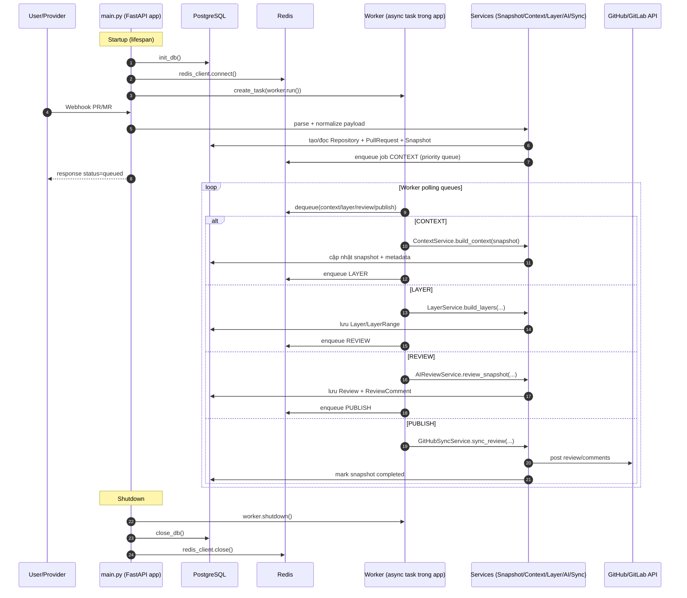

# Báo cáo dự án CodeLingerK (không lộ thông tin nhạy cảm)

## 1) Tổng quan hệ thống
- **Loại ứng dụng**: Backend AI Code Review dùng **FastAPI** + worker async.
- **Mục tiêu**: nhận sự kiện PR/MR từ GitHub/GitLab, tạo snapshot bất biến, chạy pipeline phân tích AI nhiều bước, rồi đồng bộ comment review lên provider.
- **Kiến trúc chính**: API layer (`api/routes/*`) → Service layer (`services/*`) → Data layer (`models/*`, `infra/database.py`) + Queue/Cache (`infra/redis_client.py`, `services/queue_service.py`).

## 2) Sequence diagram cho logic **main thread**

## 3) Công nghệ DB (liệt kê chi tiết)

### 3.1 PostgreSQL (DB chính)
- **Driver/ORM**: `SQLAlchemy asyncio` + `asyncpg`.
- **Migration**: `Alembic` (`alembic/versions/*`), có các mốc như:
  - thêm hỗ trợ provider GitLab,
  - thay đổi ràng buộc provider repo id,
  - thêm bảng pipeline review,
  - điều chỉnh kiểu dữ liệu review id.
- **Kết nối**: async engine với pool (`pool_size`, `max_overflow`, `pool_pre_ping`).
- **Kiểu dữ liệu Postgres dùng nhiều**:
  - `UUID` (khóa chính/phụ),
  - `JSONB` (metadata, feedback AI, result_data),
  - `ARRAY(String)` (danh sách file, review order, decorators...),
  - `BigInteger` (id provider bên ngoài).

### 3.2 Redis (DB phụ trợ: queue/cache/session)
- **Thư viện**: `redis.asyncio`.
- **Vai trò**:
  - Queue ưu tiên cho pipeline (`queue:*`, `processing`, `dead_letter`),
  - cache/session OAuth state, session user.
- **Đặc điểm**:
  - Prefix key chuẩn: `codelingerk:v1:*`,
  - hỗ trợ TTL, retry/backoff, DLQ (dead-letter queue),
  - worker polling tuần tự các queue stage.

### 3.3 Các nhóm bảng dữ liệu chính (PostgreSQL)
- **Identity & Repo**: `users`, `repositories`.
- **PR pipeline**: `pull_requests`, `snapshots`, `layers`, `layer_ranges`, `review_jobs`, `reviews`, `review_comments`.
- **Code graph**: `indexed_files`, `symbols`, `symbol_calls`, `symbol_imports`, `symbol_inheritances`.
- **Quan hệ nổi bật**:
  - Repository ↔ PullRequest ↔ Snapshot,
  - Snapshot ↔ Layer/Review/ReviewJob,
  - Review ↔ ReviewComment,
  - Repository ↔ IndexedFile ↔ Symbol (và call/import/inheritance graph).

## 4) Chức năng chính của ứng dụng (chi tiết)

1) **OAuth đa provider (GitHub/GitLab)**
- Endpoint auth riêng cho từng provider.
- Có **state lưu Redis** để chống CSRF.
- Trả JWT + profile user sau callback.

2) **Quản lý repository**
- Liệt kê repo từ provider, add/remove repo vào hệ thống.
- Clone local để phục vụ index.
- Cài webhook tự động; kiểm tra webhook stale và xử lý reinstall.

3) **Code Graph Indexing**
- Parse mã nguồn (trọng tâm Python) để trích xuất file/symbol/import/call/inheritance.
- Lưu toàn bộ graph vào PostgreSQL để query phân tích.
- Có endpoint query file, symbol, callers/callees, dependencies, class hierarchy, stats.

4) **Webhook-driven Review Pipeline (core)**
- Nhận PR/MR event (opened/reopened/synchronize/update).
- Tạo **snapshot bất biến theo commit SHA** (idempotent theo PR+commit).
- Đưa job đầu vào queue và xử lý 4 stage:
  - `CONTEXT` → dựng ngữ cảnh diff,
  - `LAYER` → phân lớp chức năng và risk,
  - `REVIEW` → AI review multi-pass, sinh comment/verdict,
  - `PUBLISH` → sync review/comment lên Git provider.

5) **Theo dõi kết quả review & vận hành queue**
- API xem danh sách PR, snapshot detail, review detail/comment.
- Retry snapshot thất bại.
- Theo dõi queue stats + job history; có retry/backoff + dead-letter.

6) **Vận hành ứng dụng**
- `main.py` quản lý lifecycle: init DB/Redis, chạy worker nền, shutdown graceful.
- `/health` kiểm tra trạng thái dịch vụ.
- Logging tập trung hỗ trợ tracing pipeline.

## 5) Lưu ý bảo mật trong báo cáo
- Báo cáo này **không chứa** token, secret, private key, password, webhook secret, API key.
- Chỉ nêu **tên nhóm cấu hình** (ví dụ OAuth/JWT/AI/Webhook/DB/Redis), không nêu giá trị thực tế.
